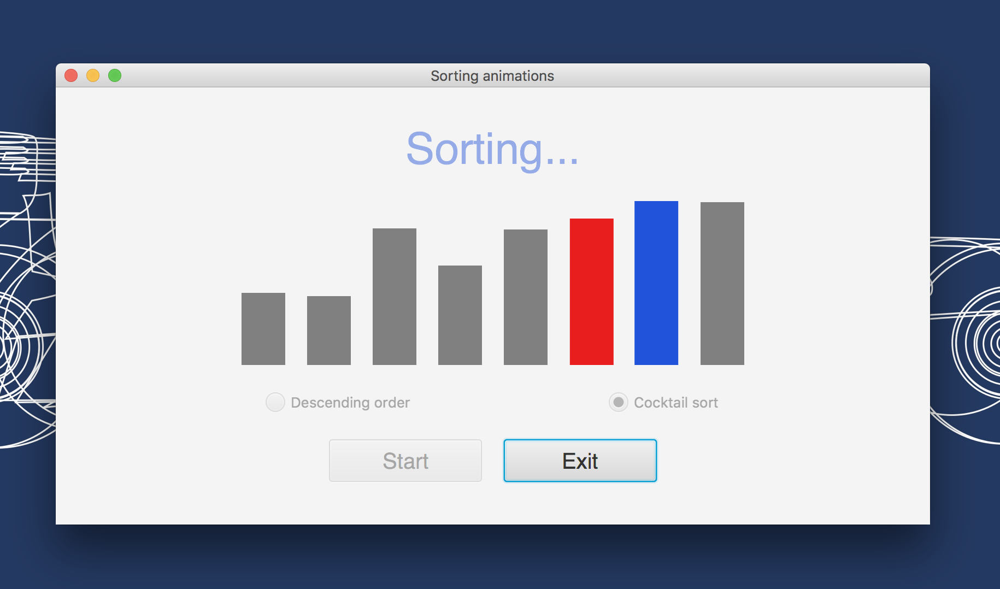
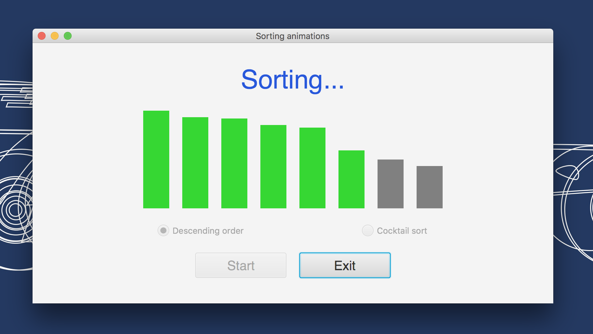
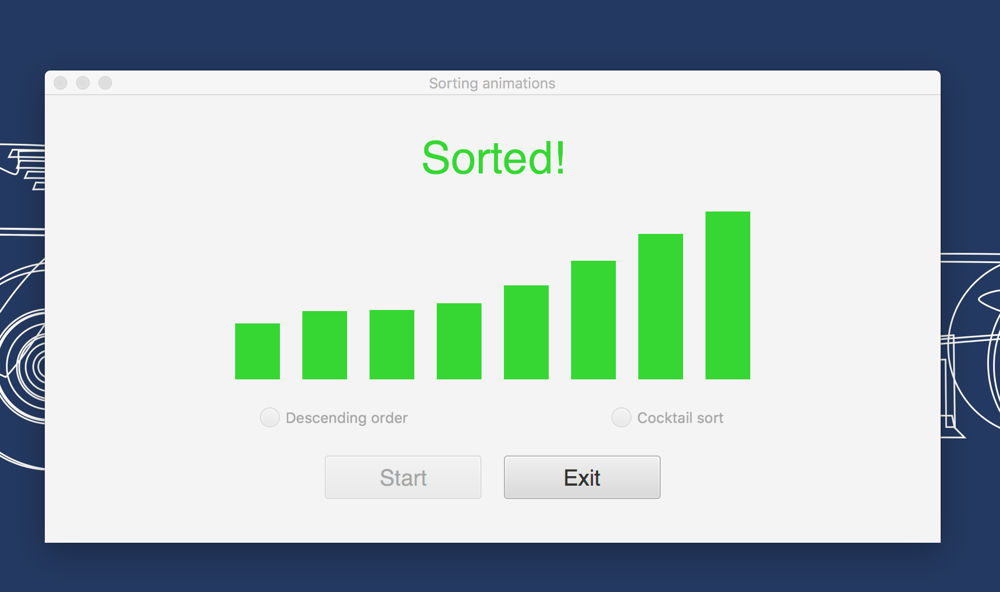
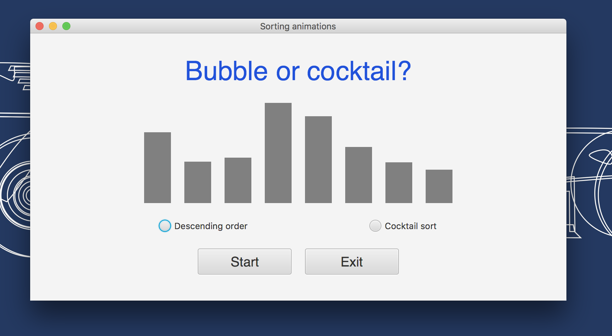

# bubble-cocktail-animations 🚦
<h3>A second year university Java animation project. 🚥</h3>
<ul>
  <li>Made for the <b>CS103 Algorithms & Data Structures</b> course. 🍏</li>
  <li>First of three projects made for that course.</li>
  <li>Full bubble sort & cocktail sort animations.</li>
  <li>Has an ascending mode & a descending mode.</li>
</ul>
<h3>Project snapshots:</h3>

View 1

View 2

View 3

View 4

View 5

