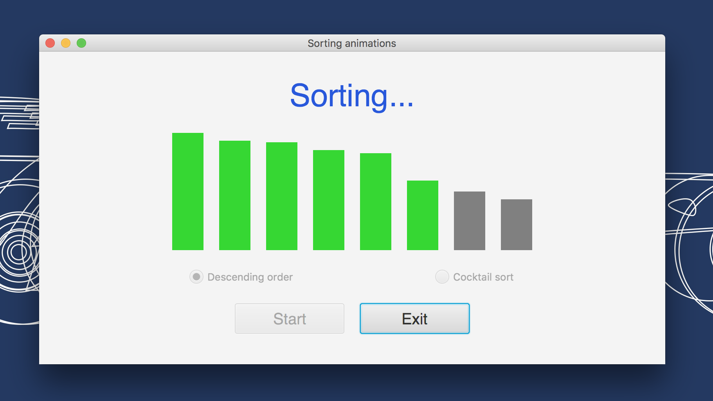
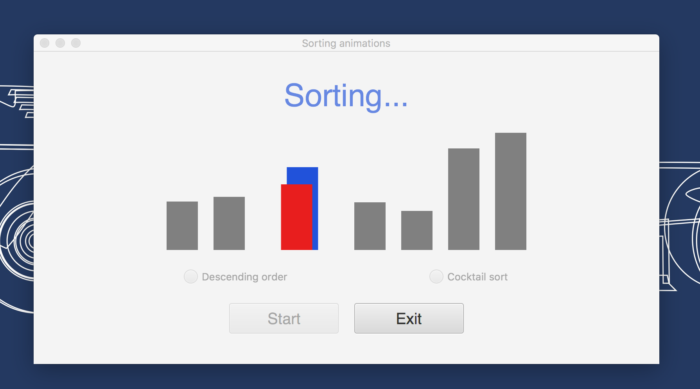

# bubble-cocktail-animations
<h3>A second year university Java animation project.</h3>
<ul>
  <li>Made for the <b>CS103 Algorithms & Data Structures</b> course. 🍏</li>
  <li>First of three projects made for that course.</li>
  <li>Full bubble sort and cocktail sort animations.</li>
  <li>Has an ascending mode and a descending mode.</li>
  <li>Built in NetBeans IDE, reworked in IntelliJ IDEA.</li>
  <li>Possible code redundancies that have not been mended yet.</li>
</ul>

#### Project snapshots:
<h6>View 1</h6>

<h6>View 2</h6>

<h6>View 3</h6>

<h6>View 4</h6>

<h6>View 5</h6>

